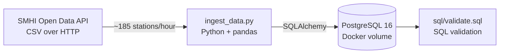
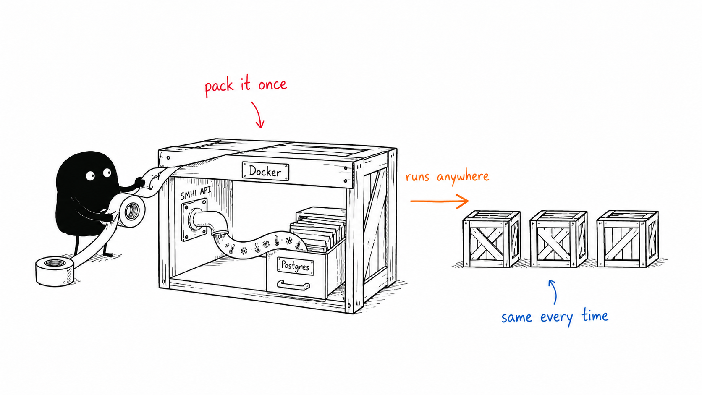
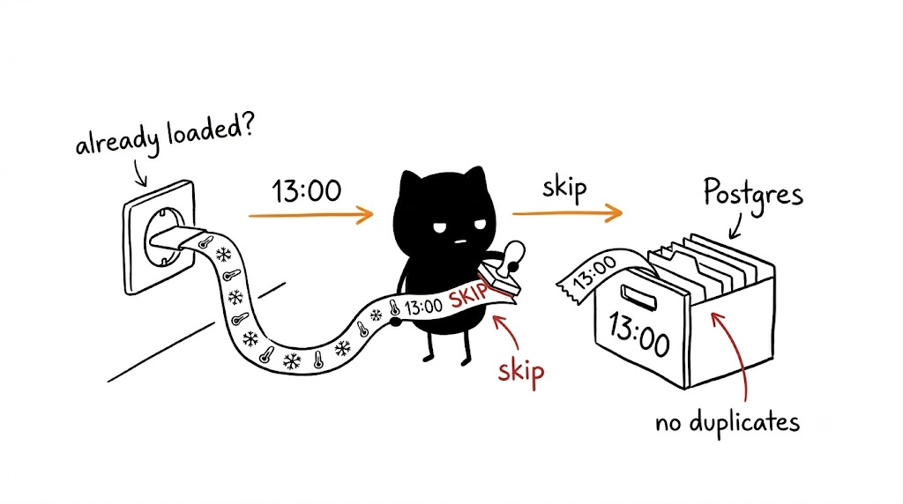
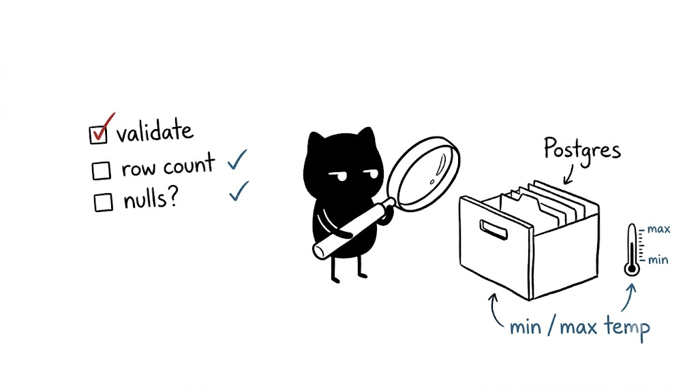
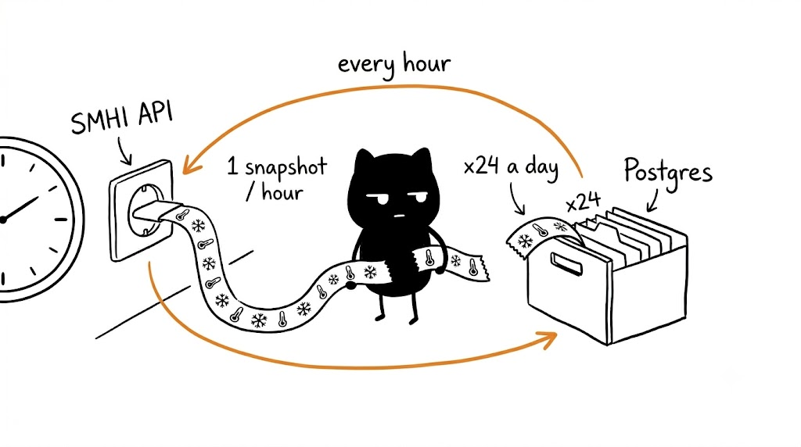

# SMHI Air Temperature Pipeline

A containerised data pipeline that ingests hourly air temperature readings
from the Swedish Meteorological and Hydrological Institute (SMHI) Open Data API
into a local PostgreSQL database.

Built as a Week 1 project for the DataTalksClub Data Engineering Zoomcamp.
Demonstrates Docker, Docker Compose, Python ingestion with pandas and SQLAlchemy,
and SQL validation queries.

<!-- ILLUSTRATION 1 of 5 — "Extract & Load" (prompt: ILLUSTRATION_PROMPTS.md → Prompt 1). Save the image as images/01-extract-load.png -->


---

## Architecture



---

## Dataset

Source: [SMHI Open Data](https://www.smhi.se/data/oppna-data) - no API key required.

Each run fetches one temperature reading per active weather station in Sweden
for the most recently completed hour. Roughly 180-185 stations per run.

```
https://opendata-download-metobs.smhi.se/api/version/1.0/parameter/1/station-set/all/period/latest-hour/data.csv
```

---

## Table schema

Table name: `smhi_air_temperature_latest_hour`

| Column | Type | Description |
|---|---|---|
| station_id | integer | SMHI station identifier |
| station_name | text | Station name |
| latitude | float | Station latitude |
| longitude | float | Station longitude |
| height_m | float | Station elevation in metres |
| temperature_c | float | Air temperature at observation time |
| quality_code | text | SMHI quality flag |
| observation_time | timestamp | Hour of the observation (from CSV header) |
| ingested_at | timestamp | UTC time the row was inserted |
| source_url | text | Source endpoint |

The ingestion script checks for the current `observation_time` before inserting,
so re-running the same hour is safe and produces no duplicates.

---

## Requirements

- Docker Desktop
- Python 3.13
- [uv](https://docs.astral.sh/uv/) package manager

---

## Setup

<!-- ILLUSTRATION 2 of 5 — "Docker" (prompt: ILLUSTRATION_PROMPTS.md → Prompt 2). Save the image as images/02-docker.png -->


Install Python dependencies:

```bash
uv sync
```

Start the PostgreSQL container:

```bash
docker compose up -d postgres
```

Verify it is running:

```bash
docker compose ps
```

Expected:

```
NAME                        IMAGE         STATUS
docker_sql-postgres-1       postgres:16   Up X minutes
```

---

## Running the ingestion

<!-- ILLUSTRATION 3 of 5 — "Idempotent load / skip duplicates" (prompt: ILLUSTRATION_PROMPTS.md → Prompt 3). Save the image as images/03-idempotent-skip.png -->


Run locally against the Postgres container with the helper script:

```bash
bash ingest.sh
```

This wraps the full command:

```bash
uv run python ingest_data.py \
  --user weather_user \
  --password weather_pass \
  --host localhost \
  --port 5432 \
  --db weather
```

First run output:

```
Fetching data from https://opendata-download-metobs.smhi.se/...
Loaded 184 rows, observation time: 2026-06-09 11:00:00
Data written to Postgres table: smhi_air_temperature_latest_hour
```

Same hour already loaded:

```
Fetching data from https://opendata-download-metobs.smhi.se/...
Loaded 184 rows, observation time: 2026-06-09 11:00:00
observation_time 2026-06-09 11:00:00 already in table, skipping.
```

Or run the full pipeline (ingestion + Postgres) via Docker Compose:

```bash
docker compose up --build
```

---

## SQL validation

<!-- ILLUSTRATION 4 of 5 — "SQL validation" (prompt: ILLUSTRATION_PROMPTS.md → Prompt 4). Save the image as images/04-sql-validation.png -->


Connect with pgcli:

```bash
pgcli -h localhost -p 5432 -U weather_user -d weather
```

Or run the validation script directly:

```bash
docker compose exec postgres psql -U weather_user -d weather -f /dev/stdin < sql/validate.sql
```

Sample queries:

```sql
-- how many hours have been loaded
SELECT observation_time, COUNT(*) AS stations
FROM smhi_air_temperature_latest_hour
GROUP BY observation_time
ORDER BY observation_time;

-- temperature range for the latest hour
SELECT
    MIN(temperature_c) AS min_temp,
    MAX(temperature_c) AS max_temp,
    ROUND(AVG(temperature_c)::numeric, 2) AS avg_temp
FROM smhi_air_temperature_latest_hour
WHERE observation_time = (SELECT MAX(observation_time) FROM smhi_air_temperature_latest_hour);

-- coldest stations right now
SELECT station_name, temperature_c, latitude, longitude
FROM smhi_air_temperature_latest_hour
WHERE observation_time = (SELECT MAX(observation_time) FROM smhi_air_temperature_latest_hour)
ORDER BY temperature_c ASC
LIMIT 5;
```

---

## Exploration notebook

`explore_smhi.ipynb` documents how I navigated the SMHI API to find the right
endpoint, inspected the CSV structure, and worked out the column parsing before
writing the ingestion script.

---

## Scheduling

<!-- ILLUSTRATION 5 of 5 — "Hourly scheduling" (prompt: ILLUSTRATION_PROMPTS.md → Prompt 5). Save the image as images/05-scheduling.png -->


To build up a time series across the day, run the script once per hour with cron.

Cron runs jobs with a minimal environment, so the crontab needs two things an
interactive shell gives you for free: `uv` on the PATH, and somewhere for the
output to go.

```bash
crontab -e
```

Add:

```
PATH=/home/<your-user>/.local/bin:/usr/bin:/bin
0 * * * * cd /path/to/docker_sql && bash ingest.sh >> ingest.log 2>&1
```

On WSL2 the cron service is not running by default. Start it with
`sudo service cron start`, or enable systemd in `/etc/wsl.conf` to make it
persist across restarts. Cron only fires while the machine, WSL, and Docker
Desktop are actually running.

After a full day you will have 24 hourly snapshots across ~185 stations. If an
hour is missing, check `ingest.log` for what went wrong.

---

## Stopping Postgres

```bash
docker compose down        # keeps the data volume
docker compose down -v     # removes the data volume as well
```

---

## What this demonstrates

- Containerised local infrastructure with Docker and Docker Compose
- Real API data extraction (HTTP CSV) rather than a static sample file
- Python ingestion with pandas and SQLAlchemy
- Idempotent loading: safe to re-run without creating duplicates
- Relational loading into PostgreSQL with metadata columns
- SQL validation queries for data quality checks

This is a local Docker/PostgreSQL prototype using Swedish SMHI Open Data. Natural
next steps would be orchestrating the hourly run (for example with Kestra) and
loading into a cloud warehouse.
